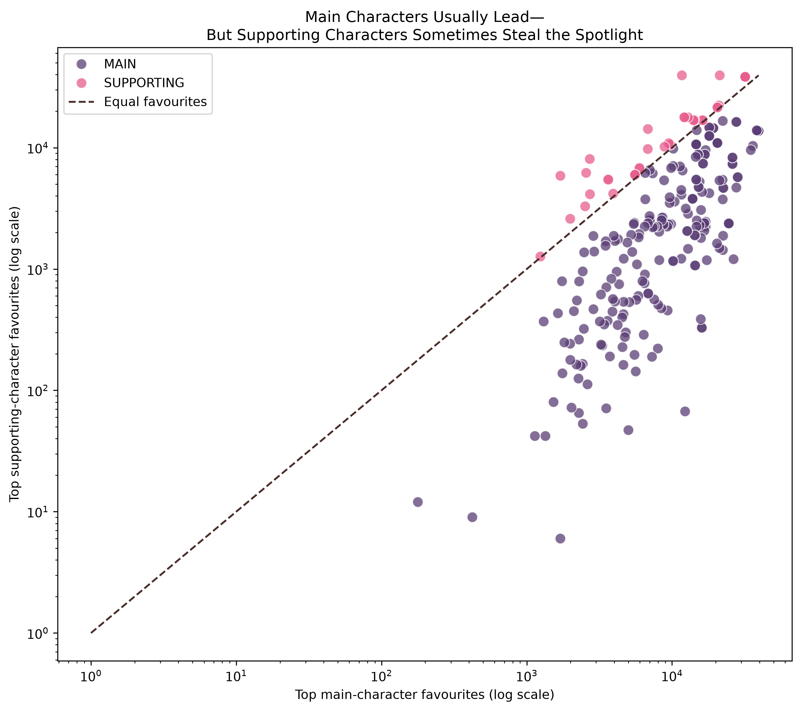
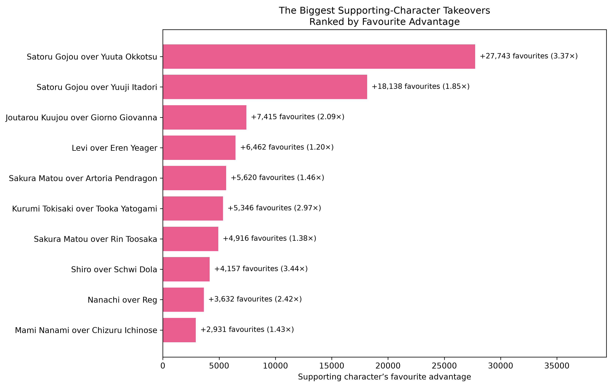
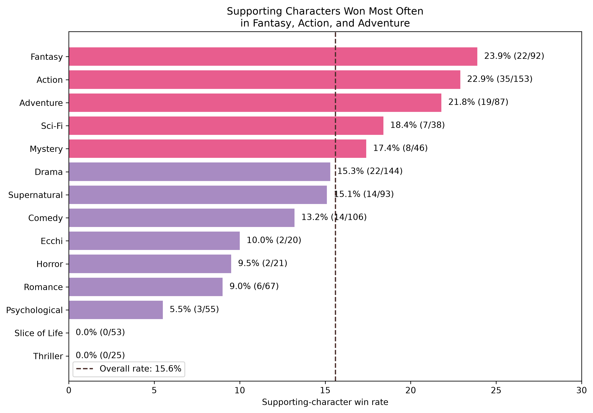

# Do Main Characters Always Win the Fandom?

An anime character popularity analysis using data extracted from the [AniList GraphQL API](https://anilist.gitbook.io/anilist-apiv2-docs/).

Main characters get top billing, sure, but do they actually win over fans the most? I compared the most-favourited main and supporting characters across 250 popular anime to see how often a side character ends up stealing the spotlight.

## Headline Result

**Main characters won 84.4% of comparisons, while supporting characters won 15.6%.**

Once I collapsed repeated main-vs-supporting matchups across sequels and seasons (so the same pairing wasn't counted twice), that supporting-character win rate dropped slightly to 12.8%. So realistically, a supporting character pulls off an upset somewhere between one in six and one in eight times, which is not common, but it happens more than you'd think.



## Key Findings

### Main characters usually lead

Across all 250 anime entries:

- Main-character winner: **211 entries (84.4%)**
- Supporting-character winner: **39 entries (15.6%)**
- Median top-main favourites: **9,074**
- Median top-supporting favourites: **2,377**

I ran a paired Wilcoxon signed-rank test to check this wasn't just noise, and the gap between main and supporting favourite counts held up as statistically significant (p < 0.001).

### Some supporting characters completely stole the spotlight

The biggest upset was in JUJUTSU KAISEN 0 — Satoru Gojou pulled 39,436 favourites, beating Yuuta Okkotsu by 27,743, or roughly 3.37 times his count. That's not even close.

A few other standout takeovers: Shiro over Schwi Dola, Kurumi Tokisaki over Tooka Yatogami, Nanachi over Reg, and Joutarou Kuujou over Giorno Giovanna.



I ranked these by raw favourite-count gap rather than ratio, since ratios get skewed when the main character's count is tiny to begin with. The ratio's still there for context, just not driving the ranking.

### Supporting-character wins varied across genres

Looking only at genres with at least 15 anime in the sample, supporting characters won most often in:

- Fantasy: **23.9% (22/92)**
- Action: **22.9% (35/153)**
- Adventure: **21.8% (19/87)**

Meanwhile, not a single supporting character won in the 53 Slice of Life or 25 Thriller entries.



It is worth noting that genres overlap here. One show can count toward several categories, so take this as a pattern worth noticing, not proof that genre causes anything. 

## What Counts as a Win?

For each anime:

1. Found the main character with the most AniList favourites
2. Found the supporting character with the most AniList favourites
3. Compared the two characters.
4. The role with the higher favourite count was classified as the winner.

AniList favourites represent the number of users who globally marked a character as a favourite. They are **not votes collected specifically within each anime entry**.

## Data

The dataset was extracted from the AniList GraphQL API on **26 September 2026**.

The extraction initially produced:

- **250 anime entries**
- **13,174 anime-character appearances**
- **10,485 unique characters**
- **11,269 main and supporting character appearances** used in the analysis

The sample contains the 250 most-popular non-adult anime entries returned by AniList at the time of extraction.

Separate seasons, sequels, films, and other franchise entries may appear independently.

## Methodology

The project workflow included:

1. Querying AniList for 250 popular non-adult anime entries
2. Extracting anime metadata, character roles, and favourite counts
3. Cleaning and validating anime-character records
4. Removing background characters from the comparison
5. Identifying each entry's leading main and supporting characters
6. Calculating winner roles, favourite gaps, and popularity ratios
7. Conducting a paired non-parametric comparison
8. Repeating the analysis using unique character pairings
9. Comparing supporting-character win rates across overlapping genres
10. Ranking the largest supporting-character takeovers

## Tools

- **Python**
- **pandas**
- **requests**
- **Matplotlib**
- **Seaborn**
- **SciPy**
- **Jupyter Notebook**
- **AniList GraphQL API**

## Repository Structure

```text
anime-character-popularity-analysis/
├── data/
│   ├── raw/          # Original AniList extracts
│   └── processed/    # Cleaned analysis-ready data
├── notebooks/        # Exploratory and statistical analysis
├── outputs/
│   ├── charts/       # Final visualisations
│   └── tables/       # Exported analytical results
├── src/              # Extraction and cleaning scripts
├── .gitignore
├── README.md
└── requirements.txt
```

## Reproducing the Project

Clone the repository:

```bash
git clone https://github.com/selmaamir/anime-character-popularity-analysis.git
cd anime-character-popularity-analysis
```

Create a virtual environment:

```bash
py -m venv .venv
```

Activate it on Windows PowerShell:

```powershell
.venv\Scripts\Activate.ps1
```

Install the required packages:

```bash
pip install -r requirements.txt
```

The extraction scripts are located in `src/`, while the complete analysis is available in `notebooks/`.

Because AniList favourite and popularity counts change over time, rerunning the extraction may produce results that differ from this dated snapshot.

## Limitations

- AniList users are not representative of every anime viewer.
- Favourite counts are global character totals rather than anime-specific votes.
- The sample includes only 250 highly popular non-adult anime entries.
- Separate entries from the same franchise can contain repeated characters.
- The same character may receive different role classifications across entries.
- Observations are not completely independent.
- Genre categories overlap.
- Favourite counts change over time.
- Results describe associations and do not establish causation.

## Conclusion

Main characters held a clear popularity advantage—but narrative prominence did not guarantee fandom dominance.

Supporting characters won only a minority of comparisons, yet several achieved decisive victories over their anime's leading main character. The results show that while main-character status matters, a memorable supporting character can still become the true face of the fandom.

---

**Data source:** [AniList](https://anilist.co/) via the AniList GraphQL API  
**Analysis:** Selma Amir